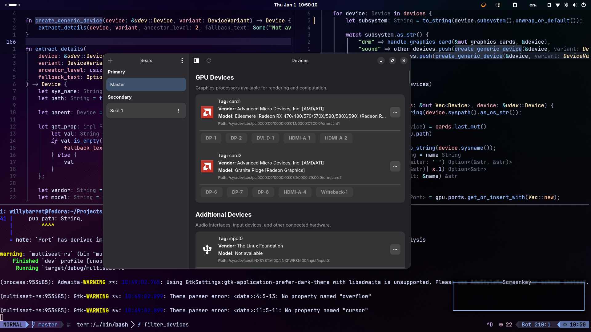
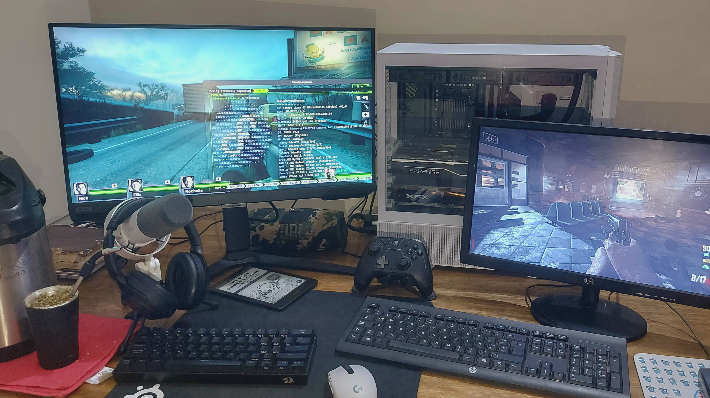

# [WIP] Multiseat Manager

A blazingly fast, seamless multiseat manager for Linux, written in Rust.

Tested on Fedora Workstation 43 (Wayland GNOME 49.2) with `gdm` and `gnome-shell` packages patched.

### Graphical User Interface



### Real-world Setup & Use Case



### ⚠️Known limitations

**Single GPU setups**: I've been doing some research and found out that it's possible to do "multiseating"
on Wayland using DRM leases of a single KMS device. Unfortunately, it's only a workaround that works on
wlroots-based Compositors using `drm-lease-manager` under the hood and it still requires patching some
packages to make everything work properly.

Perhaps adding some kind of logical DRM implementation on the Kernel to split a physical DRM device should do it?
(This is easier said than done tho). This would allow a more Compositor-agnostic solution, but you could
also argue that the Compositor should be the one that allows using DRM Leases for different seats.

For example, in the case of Mutter (GNOME's Compositor), it owns the DRM Master, just like `drm-lease-manager`
does (the workaround I've mentioned earlier). Could be the answer, or not.

Anyways, I'm going to drink some [Tereré](https://en.wikipedia.org/wiki/Terer%C3%A9) before continuing.

## To-Do List

- [x] Show available seats.
- [x] List devices attached to a seat.
- [x] Switch devices between seats.
- [x] Create and remove seats.
- [ ] Refactor code.

## Development

To use the Multiseat Manager tool:

```bash
git clone https://github.com/willybarret/multiseat-rs.git
cd multiseat-rs
cargo run

```

## Environment Setup (Patching GNOME)

Up to the present time, to enable multiseat support in GNOME, you must patch `gdm` and `gnome-shell`.
The required files are located in the `patches/` directory of this repository.

When this step becomes unnecessary (
follow [(gnome-shell) Multiseat enablement for Wayland](https://gitlab.gnome.org/GNOME/gnome-shell/-/merge_requests/2230)
if interested), these steps will be updated.

### 1. Patching GDM

```bash
mkdir -p patching-directory/gdm && cd patching-directory/gdm
dnf download gdm --source

# Extract the source rpm
rpm2cpio *.src.rpm | cpio -idmv

# Install dev dependencies
sudo dnf builddep gdm.spec

# Add your patches and update the version
# 1. Change 'Release' to something like .77 in gdm.spec
# 2. Add Patch line to gdm.spec
vi gdm.spec

# Build for Fedora 43
fedpkg --release f43 local

# Packages will be in ./x86_x64/<package-name>.rpm
# Install the patched package
sudo dnf install ./x86_64/<package-name>.rpm

```

### 2. Patching `gnome-shell`

```bash
mkdir -p patching-directory/gnome-shell && cd patching-directory/gnome-shell
dnf download gnome-shell --source

# Extract the source rpm
rpm2cpio *.src.rpm | cpio -idmv

# Install dev dependencies
sudo dnf builddep gnome-shell.spec

# Add your patches and update the version
# 1. Change 'Release' to something like .77 in gnome-shell.spec
# 2. Add Patch line to gnome-shell.spec
vi gnome-shell.spec

# Build for Fedora 43
fedpkg --release f43 local

# Packages will be in ./noarch/<package-name>.rpm and ./x86_x64/<package-name>.rpm
# Install them with
sudo dnf install ./noarch/<package-name>rpm ./x86_64/<package-name>.rpm

```

*Note: A system reboot will be required after installing these patched packages.*

Now you can start assigning devices to the seats you want with Multiseat Manager.

